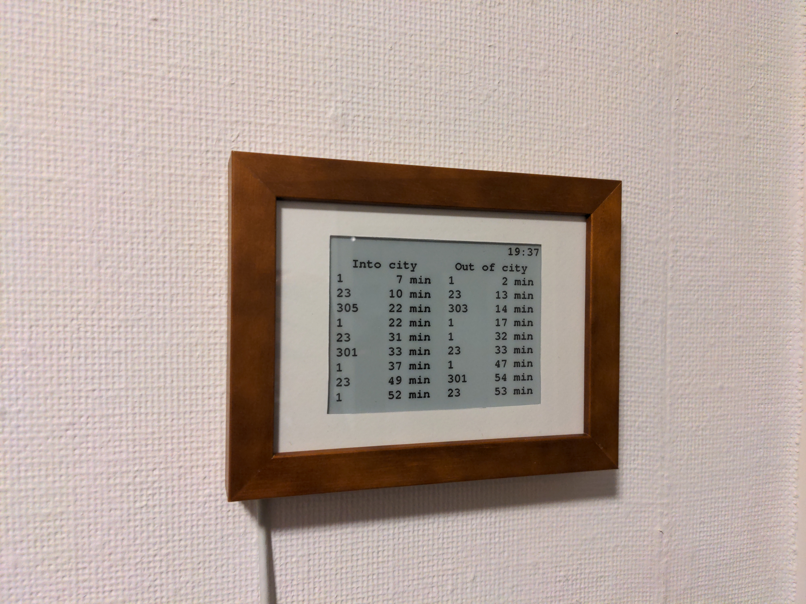

# You'd Better Run!

This project lets you know if you can walk leisurely to catch the bus, or if you'd better run.

This is a screen that hangs on the wall by the door to at a glance see how much time you have to get to the bus stop.

This project has 3 parts:
- [Firmware](https://github.com/youdbetterrun/youdbetterrun-firmware): The code that runs on the microcontroller.
- [PCB](https://github.com/youdbetterrun/youdbetterrun-pcb): The design files for the printed circuit board.
- [3D](https://github.com/youdbetterrun/youdbetterrun-3d): 3D models that need to be 3D printed and assembly instructions.

[Blog post about this project.](https://blog.marcelrobitaille.me/youdbetterrun/)
